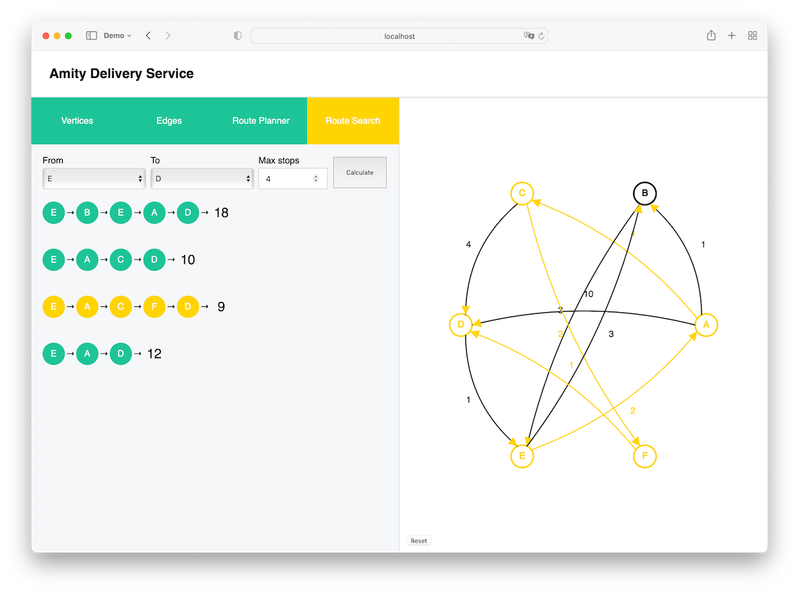

# Amity Delivery Service

Application for calculating the cost of delivery and routes

## About

Features:

- Graph vertex list editor
- Graph edge list editor
- Route builder
- Route lookup between two locations

### Vertices list editor

Use the form to add a new vertex to the list. To delete a vertex, just click on it and confirm your action.


### Edge list editor

To add a new edge use the upper form.

Use the form to update the shipping cost for the selected route, update the start and end points. There is no need to press the send button.

To delete an edge, click the delete button to the right of the selected element


### Route planner

Use available vertices to create a route. If vertex is unavailable, it will be marked as disabled. To clear the path use the red button


### Route calculator

To find all routes from one place to another, use the form to select the start and end points, specify the maximum number of stops and click Calculate. You can also click on a route to highlight it on the graph.




### Installation

```
$ npm ci
```

### Run the application in dev mode

```
$ npm start
```

### Build

```
$ npm run build
```
